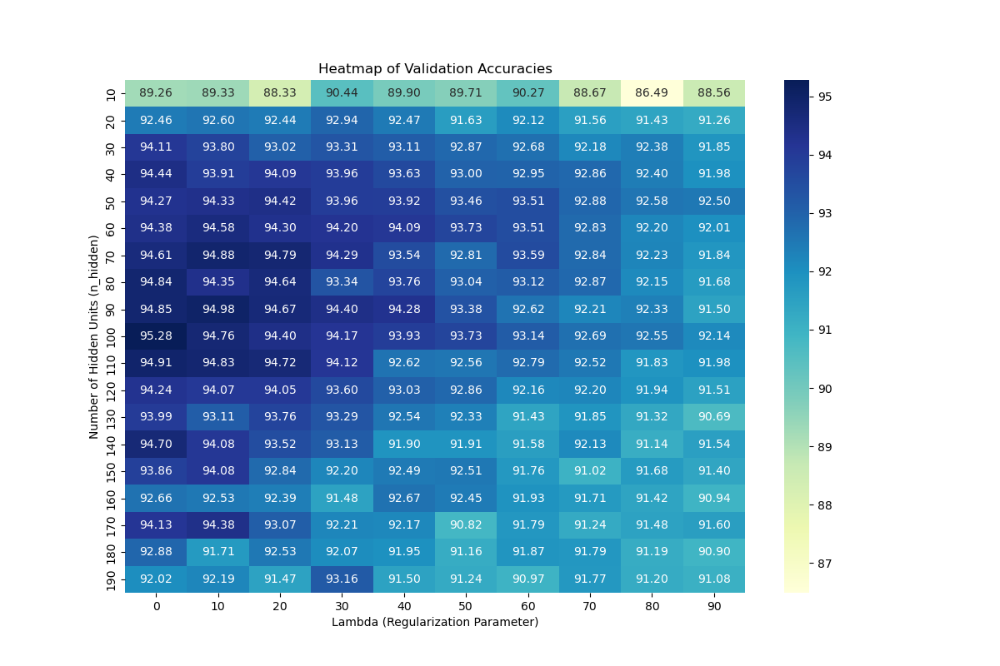
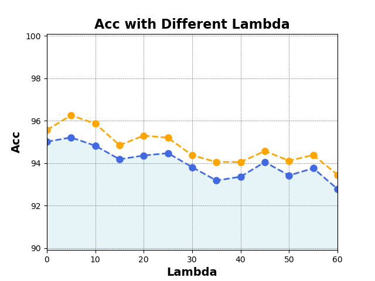
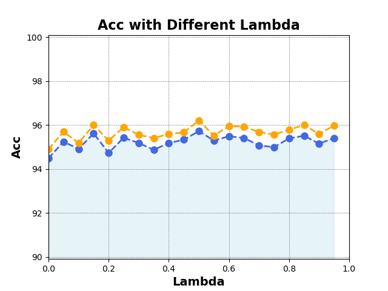
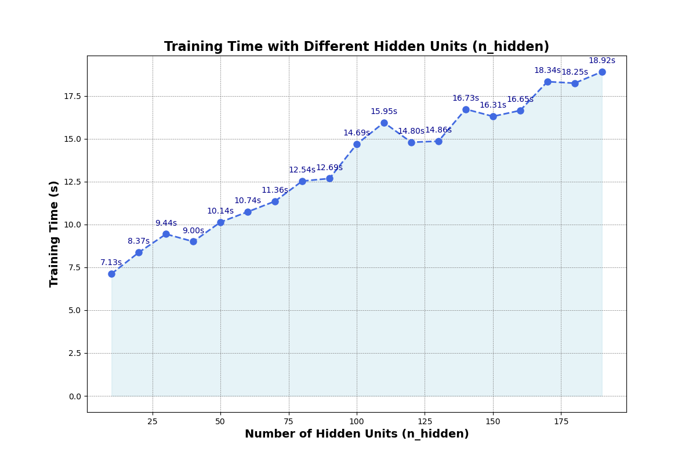
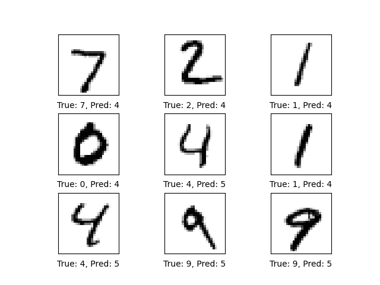
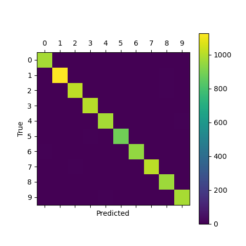
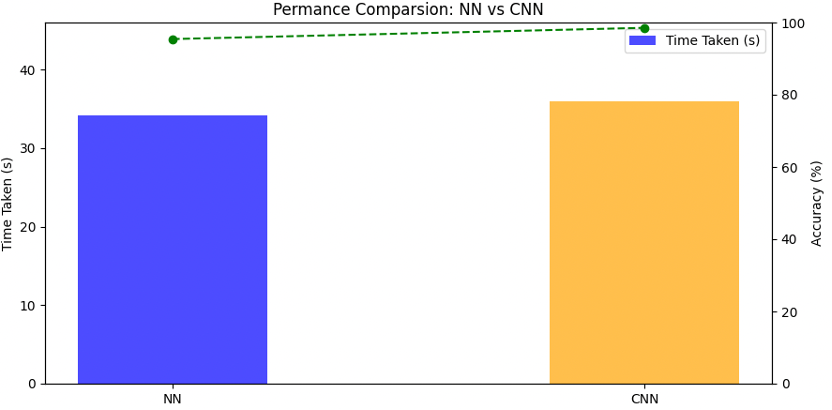
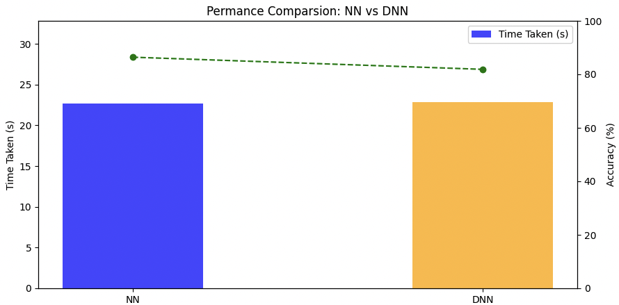

# CSE 574 Project2 Report
*Group Member: Jiabao Yao(50602483), Han Li(50993977)*

## 1. Experimental Environment
### Hardware
CPU 14900K 24 Core

Memory 128G

No GPU
### Software
OS: Ubuntu 22.04

Running **NN**: Python 3.12.7

Running **CNN & DNN**: Python 3.7.12, Tensorflow: 1.15.0


## 2. Implement MLP

### 2.1 Accuracy
We tried different `n_hidden` and `lambda` hyper-params to train this MLP, and get such result:

We use the **validation accuracy** for hyper-parmas.

During initial debugging, a grid search approach was employed to identify the optimal parameters. We began by exploring a broad range for n_hidden ([0, 200] with step size 10) and lambdaval ([0, 100] with step size 10). As n_hidden and lambdaval increase, the model's accuracy quickly converges, reaching its peak when n_hidden is 100 and lambdaval is 0. After parameters optimization, the best validation accruary for NN on the handwritten digits is 95.28%.

<div STYLE="page-break-after: always;"></div>

With this chart, we found that using around 100 as `n_hidden` can lead to better performance.

About the regularization parms `lambda`, we test other range of lambda with a fixed `n_hidden(100)`



Firstly, we try a big range from 0 to 60, and we find that when lambda is around 5, the accuracy is better.
So we run other experiments from 0 to 10



After that, we chose `lambda=0.5` for better accuracy
We got such result:
```
 Training set Accuracy:95.65599999999999%

 Validation set Accuracy:95.1%

 Test set Accuracy:95.11%
```
<div STYLE="page-break-after: always;"></div>

### 2.2 Regularization of underfitting and overfitting

It is a means or operation to impose a priori restrictions or constraints on a problem in order to achieve a specific purpose. The purpose of using regularization in the algorithm is to prevent the model from overfitting.

We can find that, when `lambda` is small like `5`, the accuracy of both training data and validation data is high, which means the model is overfitting.
However with a big `lambda > 30`, the model is underfitting which leads to a poor performance.


### 2.3 Train Time



Refer to this chart, we can find that the tarin time will increase by increasing `n_hidden`. This makes sense because more hidden node in this MLP, more computing is needed.
<div STYLE="page-break-after: always;"></div>

## 3. Compare with CNN

After 1000 iter, the cnn has such result:


And the confusion matrix is like this:


```
Time usage: 0:00:36
Accuracy on Test-Set: 98.5% (9853 / 10000)
```
Compared to NN, CNN achieves higher accuracy with a similar training time.

<div STYLE="page-break-after: always;"></div>


## 4. Compare with DNN

We adopt the `nnScript.py` to the CelebA dataset, and get such result:
```
Training set Accuracy:86.32701421800948%

Validation set Accuracy:85.29080675422139%

Test set Accuracy:86.41180923542771%

Time taken: 22.72310185432434
```

After that, we test this dataset with DNN
```
Time taken: 22.835124015808105
Accuracy: 0.8186979
```

The DNN has similar training time and worse accuracy.
We think this is because the model has so many hidden and is overfitting



